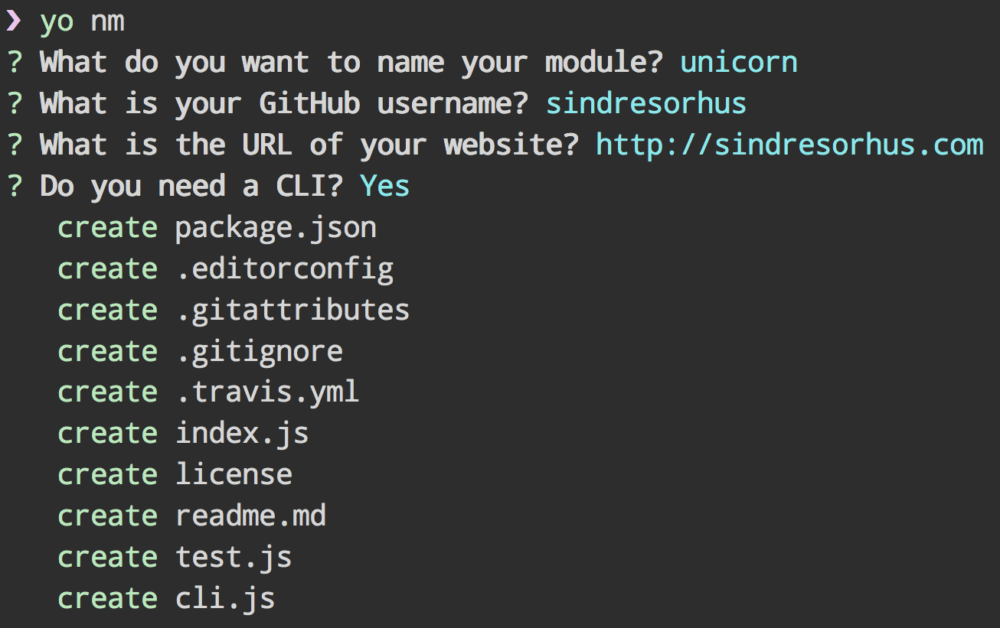

# generator-YobraveNm [](https://travis-ci.org/chinanf-boy/generator-YobraveNm)

> Scaffold out a node modules

### Copt by `sindresorhus/generator-nm`




## Install

```
npm install --global yo generator-YobraveNm
```


## Usage

With [yo](https://github.com/yeoman/yo):

```
$ yo YobraveNm
```

There are multiple command-line options available:

```
$ yo YobraveNm --help

  Usage:
    yo YobraveNm [options]

  Options:
    --help          # Print the generator's options and usage
    --skip-cache    # Do not remember prompt answers                      Default: false
    --skip-install  # Do not automatically install dependencies           Default: false
    --org           # Publish to a GitHub organization account
    --cli           # Add a CLI
    --coverage      # Add code coverage with nyc
    --codecov       # Upload coverage to codecov.io (implies --coverage)
```

The `--org` option takes a string value (i.e. `--org=avajs`). All others are boolean flags and can be negated with the `no` prefix (i.e. `--no-codecov`). You will be prompted for any options not passed on the command-line.


## Tip

Use [chalk](https://github.com/sindresorhus/chalk) if you want colors in your CLI.


## License

MIT © [Sindre Sorhus](https://sindresorhus.com)
